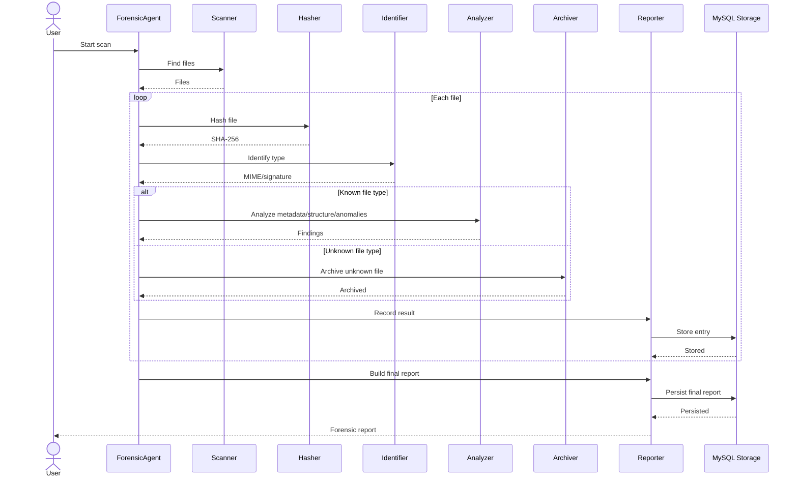

# ForensicAgent

An asynchronous file-forensics pipeline that watches a directory, hashes every new file, identifies its type, archives suspicious artefacts, and logs all findings to a CSV report and a SQLite database.

---

## Table of Contents

- [Overview](#overview)
- [Architecture](#architecture)
- [Project Structure](#project-structure)
- [Requirements](#requirements)
- [Installation](#installation)
- [Running the Agent](#running-the-agent)
- [Make Targets](#make-targets)
- [Testing](#testing)
  - [Unit Tests](#unit-tests)
  - [End-to-End Tests (Linux)](#end-to-end-tests-linux)
  - [End-to-End Tests (Windows artefacts)](#end-to-end-tests-windows-artefacts)
- [Pipeline Flow](#pipeline-flow)
- [Outputs](#outputs)
- [Allowed File Types](#allowed-file-types)
- [Design Patterns](#design-patterns)

---

## Overview

ForensicAgent monitors a `watched_directory` for new files and processes each one through a multi-stage async pipeline:

1. **Scan** — detect newly added files via `watchfiles`
2. **Hash** — compute SHA-256 and MD5 digests
3. **Identify** — detect MIME type from magic bytes and validate against an allow-list
4. **Route** — known types are forwarded for analysis; unknown / suspicious types are archived
5. **Archive** — compress unknown files to a timestamped ZIP with an embedded `checksum.txt`
6. **Report** — append a row to `forensic_report.csv` and insert a row into `forensic_report.db`

---

## Architecture

```
watched_directory
       │
       ▼
   Scanner  ──────────────► file_listener_queue
                                    │
                                    ▼
                                  Hasher  ──────► hash_queue
                                                      │
                                                      ▼
                                            IdentifierWorker
                                            ├── Reporter  ──► forensic_report.csv
                                            │               ──► forensic_report.db
                                            │
                                            ├── is_valid == False
                                            │       └── Archiver ──► archives/*.zip
                                            │                            └── checksum.txt
                                            └── is_valid == True
                                                    └── analysis_queue ──► (Analyzer)
```

### Sequence Diagram



---

## Project Structure

```
ForensicAgent/
├── main.py                        # Entry point — wires the async pipeline
├── Makefile                       # Dev / CI commands
├── Dockerfile                     # Production image
├── Dockerfile.test                # Linux E2E test image
├── Dockerfile.test.windows        # Windows artefacts E2E test image
├── docker-compose.yml
│
├── Domain/
│   ├── file_under_investigation.py  # Core data class
│   └── allowed_extensions.py        # Allow-listed MIME types (single source of truth)
│
├── EvidenceIngester/
│   ├── scanner.py                 # Watches directory with watchfiles
│   └── test_scanner.py
│
├── IntegrityChecker/
│   ├── hasher.py                  # SHA-256 + MD5 in thread executor
│   └── test_hasher.py
│
├── ArtefactAnalysis/
│   ├── identifier.py              # MIME detection via python-magic + IdentifierWorker
│   ├── archiver.py                # ZIP compression + checksum.txt + ArchiverWorker
│   ├── test_identifier.py
│   └── test_archiver.py
│
├── ArtefactReporter/
│   ├── reporter.py                # Orchestrates CSV + SQLite writes
│   ├── logger.py                  # Strategy pattern: CsvLoggingStrategy / MySQLiteLoggingStrategy
│   └── mysqliteOutboundAdapter.py # SQLite persistence layer
│
├── E2E/
│   ├── test_e2e.py                # Linux E2E — known + suspicious files over 2 s
│   ├── test_e2e_windows.py        # Windows artefacts E2E — same structure
│   └── test_e2e_archiver.py       # Dedicated archiver E2E
│
└── documentation/
    ├── sequence.mmd               # Mermaid sequence diagram
    └── forensic-agent.txt
```

---

## Requirements

- Python 3.13+
- Docker (for E2E tests)
- `watchfiles`
- `python-magic` + system library `libmagic1`

---

## Installation

```bash
# Clone the repository
git clone <your-repo-url>
cd ForensicAgent

# Create and activate a virtual environment
python3 -m venv .venv
source .venv/bin/activate

# Install dependencies
pip install watchfiles python-magic
```

> **macOS:** `libmagic` is provided by Homebrew — `brew install libmagic`  
> **Debian/Ubuntu:** `apt-get install libmagic1`

---

## Running the Agent

```bash
# Start (runs in background, logs to service.log)
make start

# Check status
make status

# Stop
make stop
```

The agent watches `./watched_directory`. Drop any file into it to trigger the pipeline.

---

## Make Targets

| Target | Description |
|---|---|
| `make start` | Start the agent as a background service |
| `make stop` | Stop the background service |
| `make status` | Check whether the service is running |
| `make unit_tests` | Run all unit tests with pytest |
| `make e2e_tests_linux` | Run the Linux E2E test in Docker |
| `make e2e_tests_windows` | Run the Windows artefacts E2E test in Docker |
| `make help` | List all available targets |

---

## Testing

### Unit Tests

```bash
make unit_tests
```

Runs 50 tests across four modules:

| Test file | Class(es) | Tests |
|---|---|---|
| `EvidenceIngester/test_scanner.py` | `TestScannerInit`, `TestHandleChanges`, `TestScannerStart` | 14 |
| `ArtefactAnalysis/test_identifier.py` | `TestIdentifier` | 9 |
| `ArtefactAnalysis/test_archiver.py` | `TestArchiverInit`, `TestArchiverArchive` | 20 |
| `IntegrityChecker/test_hasher.py` | `TestHashFile`, `TestHasher` | 7 |

### End-to-End Tests (Linux)

```bash
make e2e_tests_linux
```

Builds `Dockerfile.test`, starts a container named `forensic-agent-e2e`, and drops **8 files** into the watched directory over 2 seconds:

- **Known types** (`.txt`, `.pdf`, `.png`, `.jpg`, `.zip`) → logged to CSV / DB
- **Suspicious** (`.bin`, `.exe`, `.xyz`) → compressed to `archives/`

Stream live output:
```bash
docker logs -f forensic-agent-e2e
```

Copy generated reports out of the container:
```bash
docker cp forensic-agent-e2e:/app/forensic_report.csv .
docker cp forensic-agent-e2e:/app/forensic_report.db  .
docker cp forensic-agent-e2e:/app/archives            .
```

### End-to-End Tests (Windows artefacts)

```bash
make e2e_tests_windows
```

Same structure as the Linux test, with Windows-specific suspicious artefacts:

| File | Type |
|---|---|
| `suspicious_binary.exe` | PE32 executable (MZ header) |
| `injected_library.dll` | Windows DLL |
| `registry_export.reg` | Windows Registry export |
| `dropper.bat` | Windows batch script |
| `recon.ps1` | PowerShell script |
| `security.evtx` | Windows Event Log |
| `malware_shortcut.lnk` | Windows shortcut |

> To run inside a **real** Windows Server Core container, swap the `FROM` line in `Dockerfile.test.windows` to `python:3.11-windowsservercore-ltsc2022` and run on a Windows Docker host.

---

## Pipeline Flow

```
New file detected
       │
       ▼
  hash_file()          SHA-256 + MD5 (read-only, thread executor)
       │
       ▼
  identify_file()      Opens file in "rb" mode → magic.from_buffer()
       │               Validates extension against ALLOWED_EXTENSIONS
       │
       ├──► reporter.report()
       │        ├── CsvLoggingStrategy  → appends row to forensic_report.csv
       │        └── MySQLiteOutboundAdapter → inserts row into forensic_report.db
       │
       ├── is_valid == False
       │       └── archiver.archive()
       │               ├── <stem>_<sha256[:8]>_<timestamp>.zip
       │               │       ├── <original file>
       │               │       └── checksum.txt  (SHA-256 + MD5)
       │               └── logger.warning(...)
       │
       └── is_valid == True
               └── analysis_queue  (forwarded to Analyzer)
```

---

## Outputs

| Output | Location | Description |
|---|---|---|
| CSV report | `forensic_report.csv` | One row per identified file |
| SQLite DB | `forensic_report.db` | Table `forensic_report`, one row per file |
| Archives | `archives/*.zip` | Compressed unknown-type files + `checksum.txt` |
| Logs | stdout / `service.log` | Structured via Python `logging` module |

### CSV / DB columns

| Column | Type | Description |
|---|---|---|
| `name` | string | Filename |
| `size` | integer | Size in bytes |
| `path` | string | Absolute path |
| `created_at` | ISO-8601 | File creation timestamp |
| `modified_at` | ISO-8601 | Last modification timestamp |
| `last_accessed_at` | ISO-8601 | Last access timestamp |
| `sha256` | hex string | SHA-256 digest |
| `md5` | hex string | MD5 digest |

---

## Allowed File Types

Defined in `Domain/allowed_extensions.py` — the single source of truth:

| Extension | Expected MIME |
|---|---|
| `.pdf` | `application/pdf` |
| `.png` | `image/png` |
| `.jpg` / `.jpeg` | `image/jpeg` |
| `.zip` | `application/zip` |
| `.txt` | `text/plain` |

Files with any other extension, or whose magic bytes do not match their extension, are treated as **unknown** and routed to the Archiver.

---

## Design Patterns

| Pattern | Where |
|---|---|
| **Producer / Consumer** (async queues) | `Scanner → Hasher → IdentifierWorker → analysis_queue` |
| **Strategy** | `LoggingStrategy` → `CsvLoggingStrategy` / `MySQLiteLoggingStrategy` |
| **Outbound Adapter** | `MySQLiteOutboundAdapter` isolates SQLite from domain logic |
| **Domain constant** | `ALLOWED_EXTENSIONS` in `Domain/` shared across all layers |

